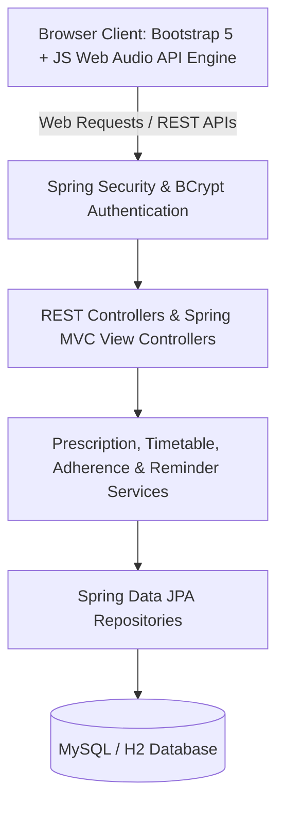
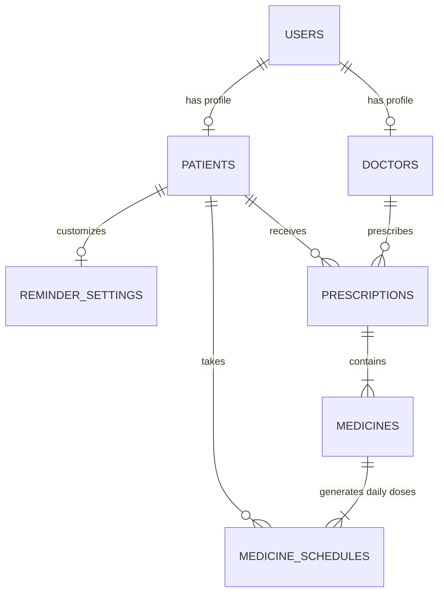

# MediTime – Smart Medical Prescription Time Table & Sound Reminder System

[](https://www.oracle.com/java/)
[](https://spring.io/projects/spring-boot)
[](https://www.mysql.com/)
[](https://getbootstrap.com/)
[](LICENSE)

> **Official Project Title:** Smart Medical Prescription Time Table & Sound Reminder System  
> **Application Brand Name:** **MediTime – Smart Medicine Scheduler**

---

## 📋 Problem Statement & Objective

Non-adherence to prescribed medication schedules is one of the leading causes of preventable medical complications and treatment failures globally. Patients frequently forget dosage timings, confuse meal instructions (before/after food), or miss doses when busy.

**MediTime** is an enterprise-ready Java Full-Stack healthcare application designed to bridge the gap between doctor prescriptions and patient compliance:
1. **Automated Conversion**: Doctors enter multi-medicine prescriptions with durations, frequencies, meal relations, and times. The system automatically computes and generates a daily, chronologically sorted medicine timetable for the patient.
2. **Real-Time Audible Sound Alarms**: When the scheduled time matches the browser clock, the application triggers a **loud repeating audio alarm** and displays a prominent modal showing the medicine name, dosage, time, and instructions until the patient acts.
3. **Patient Accountability**: Supports 1-click **Taken** (records actual timestamp), **Snooze** (reschedules for 5/10/15 mins), and **Missed** actions.
4. **Adherence Analytics**: Real-time compliance scoring based on `(Taken Doses / Total Scheduled Doses) × 100` with 7-day trend graphs.

---

## 🩺 Important Medical Safety Notice

> [!WARNING]
> **Medical Notice & Scope:** This application is a **prescription scheduling and reminder system**, not a medical decision-making system. Medication schedules shown by this application are strictly based on the entered prescription. The system does not diagnose diseases, recommend medications, or alter dosages without explicit physician instructions. Always consult a qualified healthcare professional before making changes to any medication regimen.

---

## 🛠️ Technology Stack

### Backend
- **Java**: 17+ (Fully tested on Java 17, 21, and 25 LTS)
- **Framework**: Spring Boot 3.3.4 (Spring MVC, Spring Data JPA, Hibernate, Spring Security)
- **Validation**: Jakarta Bean Validation (`@NotBlank`, `@NotNull`, `@Min`, `@Pattern`)
- **Security**: Spring Security with **BCrypt** password hashing, Role-Based Access Control (`DOCTOR`, `PATIENT`)
- **Database**: MySQL 8.0+ (with embedded H2 in MySQL-mode for instant zero-configuration demo setup)
- **Build Tool**: Apache Maven

### Frontend
- **UI Framework**: HTML5, CSS3, Bootstrap 5.3, Font Awesome 6
- **Audio Engine**: JavaScript **Web Audio API** (Pure mathematical multi-oscillator sound synthesizer: Medical Beep, Gentle Chime, Pulse Siren, Urgent Alert)
- **Client Logic**: Vanilla ES6+ JavaScript, real-time polling scheduler, live countdown clock, dynamic DOM form builder

---

## 🏛️ System Architecture



---

## 🗄️ Database Schema & Entities

The database structure is normalized with foreign keys, indexes, and cascading relationships:



1. **`users`**: `id`, `name`, `email` (unique), `password` (BCrypt), `role` (`DOCTOR`/`PATIENT`), `phone`, `created_at`
2. **`doctors`**: `id`, `user_id` (FK), `specialization`, `license_number`, `hospital_affiliation`, `qualification`
3. **`patients`**: `id`, `user_id` (FK), `date_of_birth`, `gender`, `blood_group`, `emergency_contact`, `address`
4. **`reminder_settings`**: `id`, `patient_id` (FK), `sound_enabled`, `volume`, `snooze_minutes`, `alarm_sound`
5. **`prescriptions`**: `id`, `doctor_id` (FK), `patient_id` (FK), `prescription_date`, `start_date`, `end_date`, `diagnosis`, `notes`, `created_at`
6. **`medicines`**: `id`, `prescription_id` (FK), `medicine_name`, `medicine_type`, `dosage`, `frequency`, `duration_days`, `meal_instruction`, `special_instruction`
7. **`medicine_reminder_times`**: `medicine_id` (FK), `reminder_time` (e.g. "08:00", "14:00", "20:00")
8. **`medicine_schedules`**: `id`, `medicine_id` (FK), `patient_id` (FK), `scheduled_date`, `scheduled_time`, `status` (`PENDING`, `TAKEN`, `MISSED`, `SNOOZED`), `taken_at`, `snoozed_until`, `notes`

---

## 👥 User Roles & Workflows

### 🩺 Doctor Workflow
1. **Login**: Access the Doctor Portal (`/doctor/dashboard`).
2. **Patient Directory**: View all registered patients with their overall adherence compliance.
3. **Create Prescription**: Fill diagnosis, start date, end date, and dynamically add medicines:
   - Select frequency (e.g. *3 times per day* auto-populates `08:00`, `14:00`, `20:00`).
   - Specify meal relation (*Before food, After food, With food, Empty stomach*).
   - Real-time **Live Timetable Preview** computes on the right as you type.
4. **Save & Generate**: Instantly creates daily schedules in `medicine_schedules` for all treatment days.
5. **History & Monitoring**: View patient's complete prescription records and dose adherence log.

### 💊 Patient Workflow
1. **Login**: Access the Patient Portal (`/patient/dashboard`).
2. **Live Next Dose Countdown**: Prominent banner showing upcoming dose (e.g., *Paracetamol 500 mg at 08:00 PM*) with a live ticking countdown (`01:25:32`).
3. **Today's Medicine Timetable**: View chronologically sorted schedule with 1-click status actions (`Taken`, `Snooze 10m`, `Missed`).
4. **Sound Reminder System**:
   - Audio engine automatically checks scheduled medicines in real-time.
   - When a dose is due, triggers a loud multi-tone repeating alarm and flashes the screen.
   - Displays modal with medicine name, dosage, meal relation, and action buttons.
5. **Full Calendar / Timetable**: Navigate day-by-day (Yesterday, Today, Tomorrow, or pick any custom date).
6. **Adherence Statistics**: Visual dashboard showing Today's and Overall adherence percentage, total taken vs missed doses, and a 7-day compliance history table.
7. **Reminder Settings**: Toggle sound ON/OFF, adjust master volume slider (0-100%), change alarm tones (*Medical Beep, Gentle Chime, Pulse Siren, Urgent Alert*), and test sound in browser.

---

## ⚡ Quick Demo Credentials

| Role | Email | Password | Pre-loaded Data |
|---|---|---|---|
| **Doctor** | `dr.arun@meditime.com` | `password123` | Dr. Arun Verma (Cardiologist, Apollo Health) |
| **Patient 1** | `rahul@meditime.com` | `password123` | Rahul Sharma (Active Rx with Paracetamol, Amoxicillin, Vitamin D3) |
| **Patient 2** | `priya@meditime.com` | `password123` | Priya Patel (Registered Patient) |

*(The login page includes 1-click autofill buttons for instant testing without typing.)*

---

## 🚀 Installation & Running Instructions

### Prerequisites
- **Java 17 or higher** (`java -version`)
- **Maven 3.8+** (or use included Maven commands)
- **MySQL 8.0+** *(optional - default profile runs out-of-the-box with embedded database)*

---

### Option A: Quick Run (Zero-Configuration with Default Embedded Database)

The application is pre-configured with a file-backed H2 database in MySQL-compatibility mode (`./data/meditime.mv.db`), requiring **zero database setup**:

```powershell
# 1. Clone or navigate to the project directory
cd "c:\Users\Dhanush Teja\OneDrive\Desktop\MEDICINE"

# 2. Build and run with Maven
& "C:\tools\apache-maven-3.9.6\bin\mvn.cmd" spring-boot:run
```

Or run the packaged JAR directly:
```powershell
java "-Dnet.bytebuddy.experimental=true" -jar target\meditime-scheduler-1.0.0.jar
```

Open your browser and navigate to: **`http://localhost:8080`**

---

### Option B: Running with Native MySQL Database

1. Open MySQL Workbench or MySQL CLI and ensure MySQL is running on `localhost:3306`.
2. Create the database:
   ```sql
   CREATE DATABASE IF NOT EXISTS meditime_db;
   ```
3. Update `src/main/resources/application-mysql.properties` with your MySQL username and password if different from `root/root`:
   ```properties
   spring.datasource.url=jdbc:mysql://localhost:3306/meditime_db?createDatabaseIfNotExist=true&useSSL=false&allowPublicKeyRetrieval=true&serverTimezone=UTC
   spring.datasource.username=root
   spring.datasource.password=your_mysql_password
   ```
4. Run with the `mysql` profile:
   ```powershell
   & "C:\tools\apache-maven-3.9.6\bin\mvn.cmd" spring-boot:run -Dspring-boot.run.profiles=mysql
   ```

---

## 🔊 How to Test the Sound Reminder

Due to modern browser autoplay policies, browsers require one user interaction before playing audio:
1. Log in as Patient (**`rahul@meditime.com`** / `password123`).
2. On the top navigation bar or dashboard, click **"Enable Sound Reminders"** or navigate to **Settings** (`/patient/settings`).
3. Click the **"Test Sound"** button to hear the synthesized audio tone.
4. When any dose is scheduled for the current time (or when creating a prescription with current time), the **Medicine Alarm Modal** will immediately pop up with loud repeating audio until you click **[ STOP & MARK TAKEN ]**, **[ SNOOZE 10 MIN ]**, or **[ MARK MISSED ]**.

---

## 📡 REST API Documentation

All secured endpoints support Session-based and HTTP Basic Authentication.

| Method | Endpoint | Description |
|---|---|---|
| `POST` | `/api/auth/register` | Register a new Doctor or Patient |
| `POST` | `/api/auth/login` | Authenticate user credentials and return profile info |
| `GET` | `/api/auth/me` | Get current logged in user details |
| `POST` | `/api/prescriptions` | Create prescription & generate daily timetable schedules |
| `GET` | `/api/prescriptions` | List all prescriptions |
| `GET` | `/api/prescriptions/{id}` | Get prescription details with medicine list |
| `DELETE`| `/api/prescriptions/{id}` | Delete prescription and its associated schedules |
| `GET` | `/api/schedules/today` | Get today's chronologically sorted medicine timetable |
| `GET` | `/api/schedules/date/{date}` | Get timetable for a specific date (`YYYY-MM-DD`) |
| `GET` | `/api/schedules/active-alarms` | Get currently due/ringing alarms |
| `GET` | `/api/schedules/next-dose` | Get the next upcoming dose for the countdown timer |
| `PUT` | `/api/schedules/{id}/taken` | Mark dose as TAKEN (records timestamp) |
| `PUT` | `/api/schedules/{id}/missed` | Mark dose as MISSED |
| `PUT` | `/api/schedules/{id}/snooze` | Snooze dose for X minutes (`{"minutes": 10}`) |
| `GET` | `/api/patients/{id}/statistics`| Get today's and overall adherence metrics & 7-day trend |
| `GET` | `/api/patients/{id}/history` | Get full medication history log |
| `GET` | `/api/settings/reminder` | Get patient audio reminder preferences |
| `PUT` | `/api/settings/reminder` | Update reminder sound, volume, and snooze settings |

---

## 🧪 Running Automated Tests

Run the full JUnit 5 & Mockito test suite:

```powershell
& "C:\tools\apache-maven-3.9.6\bin\mvn.cmd" test
```

### Test Coverage Summary:
- **`AuthServiceTest`**: Doctor/Patient registration, duplicate email handling, login validation.
- **`PrescriptionServiceTest`**: Multi-medicine prescription saving, date-range schedule generation, frequency parsing.
- **`ScheduleServiceTest`**: Status transitions (Taken timestamping, Missed, Snooze intervals).
- **`AdherenceServiceTest`**: Compliance formula verification, daily breakdown calculations.
- **`PrescriptionRestControllerTest`**: MockMvc API validation for prescription creation and retrieval.

---

## 📂 Project Structure

```
c:/Users/Dhanush Teja/OneDrive/Desktop/MEDICINE/
├── pom.xml
├── README.md
├── src/
│   ├── main/
│   │   ├── java/com/medtime/
│   │   │   ├── MediTimeApplication.java
│   │   │   ├── config/
│   │   │   │   ├── SecurityConfig.java
│   │   │   │   └── DataInitializer.java
│   │   │   ├── controller/
│   │   │   │   ├── AuthRestController.java
│   │   │   │   ├── PrescriptionRestController.java
│   │   │   │   ├── ScheduleRestController.java
│   │   │   │   ├── PatientRestController.java
│   │   │   │   ├── DoctorRestController.java
│   │   │   │   ├── ReminderSettingsRestController.java
│   │   │   │   ├── HomeController.java
│   │   │   │   ├── DoctorViewController.java
│   │   │   │   └── PatientViewController.java
│   │   │   ├── dto/
│   │   │   │   ├── AuthRequest.java / AuthResponse.java / RegisterRequest.java
│   │   │   │   ├── PrescriptionRequest.java / PrescriptionResponseDto.java
│   │   │   │   ├── MedicineDto.java / MedicineScheduleDto.java
│   │   │   │   ├── AdherenceStatsDto.java / ReminderSettingsDto.java / SnoozeRequest.java
│   │   │   │   ├── PatientDto.java / DoctorDto.java / ApiResponse.java
│   │   │   ├── entity/
│   │   │   │   ├── User.java / Role.java
│   │   │   │   ├── Doctor.java / Patient.java
│   │   │   │   ├── Prescription.java / Medicine.java
│   │   │   │   ├── MedicineSchedule.java / ScheduleStatus.java
│   │   │   │   └── ReminderSetting.java
│   │   │   ├── exception/
│   │   │   │   ├── GlobalExceptionHandler.java
│   │   │   │   ├── ResourceNotFoundException.java
│   │   │   │   ├── BadRequestException.java
│   │   │   │   └── UnauthorizedException.java
│   │   │   ├── repository/
│   │   │   │   ├── UserRepository.java / DoctorRepository.java / PatientRepository.java
│   │   │   │   ├── PrescriptionRepository.java / MedicineRepository.java
│   │   │   │   ├── MedicineScheduleRepository.java
│   │   │   │   └── ReminderSettingRepository.java
│   │   │   ├── security/
│   │   │   │   ├── CustomUserDetails.java
│   │   │   │   └── CustomUserDetailsService.java
│   │   │   ├── service/
│   │   │   │   ├── AuthService.java / PrescriptionService.java / ScheduleService.java
│   │   │   │   ├── PatientService.java / DoctorService.java
│   │   │   │   ├── AdherenceService.java / ReminderSettingsService.java
│   │   │   └── util/
│   │   │       └── ScheduleTimeHelper.java
│   │   └── resources/
│   │       ├── application.properties
│   │       ├── application-mysql.properties
│   │       ├── static/
│   │       │   ├── css/style.css
│   │       │   └── js/
│   │       │       ├── sound-engine.js
│   │       │       ├── reminder-system.js
│   │       │       └── prescription-form.js
│   │       └── templates/
│   │           ├── layout/main.html
│   │           ├── home.html / login.html / register.html / about.html
│   │           ├── doctor/
│   │           │   ├── dashboard.html / create-prescription.html
│   │           │   ├── prescriptions.html / prescription-detail.html
│   │           │   ├── patients.html / patient-history.html
│   │           └── patient/
│   │               ├── dashboard.html / timetable.html / history.html
│   │               ├── statistics.html / settings.html / profile.html
│   └── test/
│       └── java/com/medtime/
│           ├── controller/PrescriptionRestControllerTest.java
│           └── service/
│               ├── AuthServiceTest.java
│               ├── PrescriptionServiceTest.java
│               ├── ScheduleServiceTest.java
│               └── AdherenceServiceTest.java
```

---

## 🎓 College Presentation Highlights

When demonstrating this project for academic evaluation or clinical showcase:
1. **Explain the Layered Architecture**: Model-View-Controller (MVC) separation, DTO encapsulation, Service layer business logic, and JPA ORM mapping.
2. **Demonstrate Automated Timetable Generation**: Show how entering a single prescription generates daily dose schedules across the treatment date range.
3. **Trigger the Real-Time Alarm**: Open the patient dashboard, test the Web Audio API sound tones, and demonstrate the modal prompt with Taken, Snooze, and Missed actions.
4. **Present Adherence Analytics**: Show the mathematical formula and real-time computation of compliance rates from stored medication history.
5. **Highlight Medical Safety Disclaimer**: Show how the application explicitly avoids automated medical decision making while enforcing prescription accuracy.
